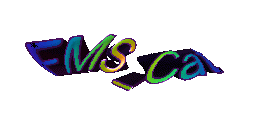

  

Welcome to my github profile!

I'm calling myself a "creative coding enthusiast".  
I usually do creative coding stuff using web tech. More specifically, I'm a demoscener who makes [WebGL demos](https://github.com/FMS-Cat/until) and [tools for creating demos](https://github.com/FMS-Cat/automaton).

I also love rhythm games! I am a contributor of [NotITG](https://notitg.heysora.net/) , which is a fork of Stepmania with silly modifications.

I'm currently working as an engineer for a company that do 3D avatar stuff.  
I'm using [Three.js](https://github.com/mrdoob/three.js) and [VRM](https://github.com/vrm-c/vrm-specification) during my work time so you might see me at these repositories.

My main language is Japanese but I'm trying my best to deliver in English for topics that you might be interested!  
I prefer he/him for my pronoun but they/them is still 100% acceptable.

- 🌐 [fms-cat.com](https://fms-cat.com)
- 💬 [Twitter](https://twitter.com/FMS_Cat)
- 📼 [YouTube](https://www.youtube.com/channel/UCK1Mn6u0vl3VeW5SCwMT1eg)
- 📝 [Scrapbox](https://scrapbox.io/fms-cat/)
- 🎺 [pouët](https://www.pouet.net/user.php?who=98998)

